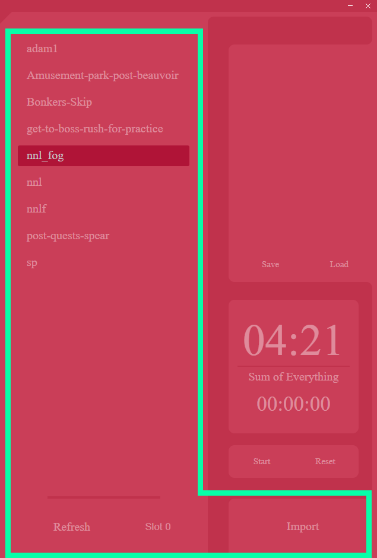
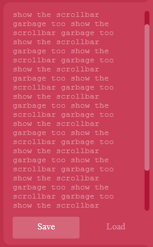

# (aloyark's)NieR Automata Save Manager - (a)NASM

I'm lazy, so I decided that making a full stack application to move files was a good idea.

## Setup

#### Where to put the Saves?

The `Saves` folder in with the `Buffer`, `ImportBuffer`, and `Backup` folders. When naming your practice saves make sure that they don't have spaces in the name otherwise it just wont work. I'll fix this later but for the time being just don't put spaces in the name.

You want to take a save that has your controls and setting.

  

The saves use zero based counting so this is how they're laid out in the game.


Copy that save over to `ImportBuffer` in the `Saves` folder and rename it to

```
SlotDataOriginal.dat
```

This is so the importer can actually import your shit

### _fog

If you put `_fog` at the end of a files name like this,

```
Practice-save-name_fog.dat
```

It will then take that save file and run it through the save importer I made, that's loosely based on the original *fogs Save Importer Tool*. Now why the fuck is this necessary?

TL;DR

- Saves from other people don't work with your game 
- You put `_fog` at the end of the save name
- Save goes into Importer and it goes brrrrrrrr, now you can use it.
- Don't put `_fog` at the end
- Importer don't go brr
- Save don't work :(


If you want to use a save from someone else's game then you're going to have to import it. Why? Lets say you just shove the non-importer save in the default save folder. You'll notice that It does nothing when you try to load it. I'm not entirely sure what happens, but I believe, when you try to load someone else's save and your steam id doesn't match the one encoded into the save, the game just rejects it. Hence why we import it. 

1. Store the chunks of data we want (`Steamid`, `Settings`, and `Controls`) from the `SaveSlotOriginal.dat` we setup earlier. 
2. Store the chunks of data we want from the save we need to import 

Replace the chunks we took out of 

The settings and controls aren't needed but they're a nice thing to add. Plus It wasn't that much work to do it anyway. 

It also Imports your settings and controls to the save file from `SlotDataOriginal.dat`

## What's functional?

Barely anything.

This shit works



Everything here is self explanatory 

## W.I.P



#### Trick list

- Save and load buttons don't do anything yet
- Not really a list(yet), just a text area
- Want to make it so you can keep track of data
- Make a graph so that you can analyze your data nicely

#### Timer


- Timer works on it's own
- Need to integrate it with importing a save, so you can see how long you've been practicing a save
- Ties into the graph thing I said in the trick list
- Sum of Everything(all practice time) isn't integrated yet

You need to stop the timer to reset it 

#### 


## Issues 

- The code is Garbo ill fix it later.
- Not being open source because I have to fix my spaghetti code.
- Text box area just fucking kills itself if you import anything and un-off's itself if you select another window and go back to it again.
- Kinda goes full retardo if you minimize the program. But its ok because if just jiggle a it a lil bit it'll be ok.
- Topbar close and minimize buttons are a little wonky
- application looks dumb as hell because I'm stupid and can't figure out how to make a standalone exe for the app